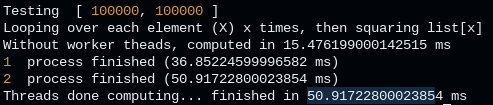
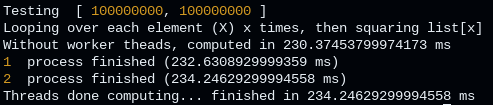
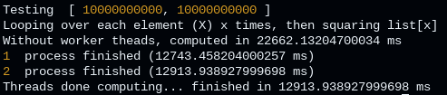
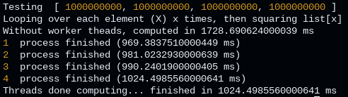
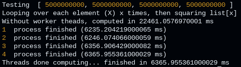
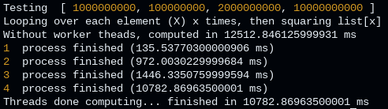
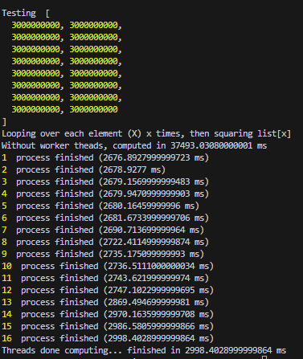

# Worker_Threads_Test

Testing out how worker_threads performs and possible use cases

We looped over a massive quantity of numbers and squared them to simulate a difficult work job for the comupter

## Results:
### Small Dataset (2 Cores)

Synchronous processing seems to be faster becuase of the latency when communicating with the threads 

### Medium Dataset (2 Cores)

Still worker threads is marginally slower.

### Large Dataset (2 Cores)

This time, worker threads beats synced processing by a large margin

### Large Dataset (4 cores)

### Massive Dataset (4 Cores)

Once again, worker threads is significantly faster than single threaded.  ~4 times faster, as expected, as we have 4 cores

### Variable Dataset (4 cores)

This time worker_threads is not a clear winner, with just a 2 second lead on synced processing.

### Gigantic Dataset (48 Million times to loop and square the numer)
#### 8 real cores, 8 virtual cores

Worker_threads is ~13 times faster this time

## Conclusions
Use worker_threads when you need massive computations to be done, otherwise the latency in communicating with the cores is too massive and will set you back.